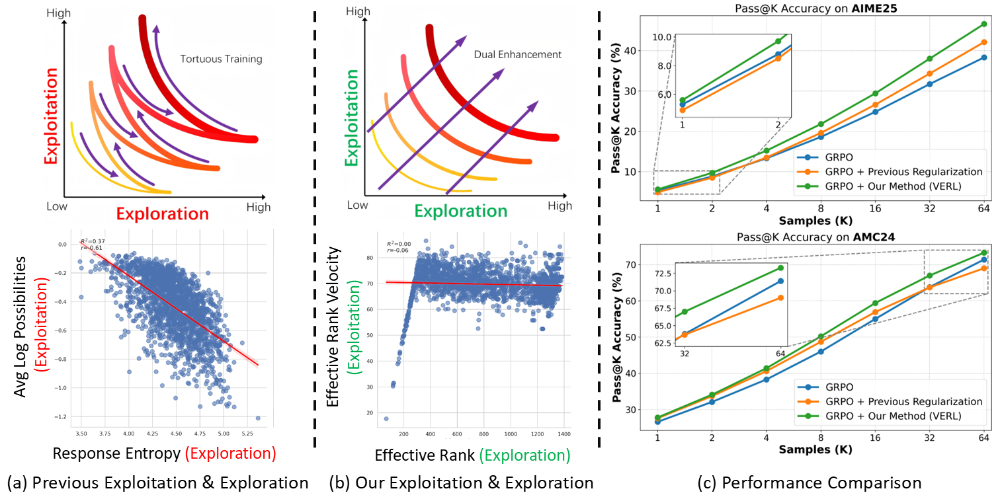

<h1 align="center">
<br>
<!-- <br style="display: block; content: ''; margin-top: 0.5em;" /> -->
Velocity-Exploiting Rank-Learning (VERL)</span>
</h1>

<div align="center">


</div>

<p align="center">
  <a href="https://hf618.github.io/VERL.github.io/"><b>[🌐 Website]</b></a> •
  <a href="https://arxiv.org/abs/2509.23808"><b>[📜 Paper]</b></a> •
  <a href="https://github.com/hf618/VERL"><b>[🐱 GitHub]</b></a>
</p>


<p align="center">
Repo for "<a href="https://arxiv.org/abs/2509.23808" target="_blank">Beyond the Exploration-Exploitation Trade-off: A Hidden State Approach for LLM Reasoning in RLVR</a>"
</p>

<br>

<p align="center">
    
        <br>
    <em>Figure 1: Comparative analysis with the responses of <a href="https://huggingface.co/deepseek-ai/DeepSeek-R1-Distill-Qwen-7B">DeepSeek-R1-Distill-Qwen-7B</a> in <a href="https://github.com/hkust-nlp/simpleRL-reason">simpleRL-reason</a> test dataset (Level 3 to 5). (a) Traditional metrics for exploitation and exploration are constrained by negative coupling, leading to meandering progress for both capabilities. (b) Our metrics are mutually independent. (c) Training regularization with our metrics demonstrates stronger performance in both exploitation (small K) and exploration (large K).
    </em>
</p>


<!-- <br> -->

## 🔥 News

<!-- - [2023/10/13] 🔥🔥🔥 We release a demo for ToRA at [🐯 Gradio](https://9557c5365a6f44dc84.gradio.live), try it out!!! -->
<!-- - [2023/06/13] We release all prompts used in the SwS framework in <a href="https://github.com/MasterVito/SwS/tree/master/prompts"><b>prompts</b></a>.
- [2023/06/13] We update the demo set of synthetic problems from SwS in <a href="https://github.com/MasterVito/SwS/tree/master/datasets"><b>datasets</b></a>, including 500 samples for each model and category. You can also find them in <a href="https://huggingface.co/datasets/MasterVito/SwS-Demo-Dataset"><b>Demo Dataset</b></a>. -->
- [2025/10/10] **We provide the full code for training and evaluation for Velocity-Exploiting Rank-Learning.**
- [2025/09/28] Our paper, repository, website released.

<!-- <br> -->

## 🚀 Analysis, Method, Results

For a brief description, please refer to our [Project Page](https://hf618.github.io/VERL.github.io/); for a detailed description, please refer to the [paper](https://arxiv.org/abs/2509.23808).

## 🚀 Quick Start

### ⚙️ Setup

Our code is implemented based on [simpleRL-reason](https://github.com/hkust-nlp/simpleRL-reason). We recommend using [Conda](https://docs.conda.io/projects/miniconda) to manage your environment. We use [vLLM](https://github.com/vllm-project/vllm) (0.5.4) to accelerate inference. Run the following commands to setup your environment:

```sh
conda create -n verl python==3.10.16
conda activate verl
pip3 install torch==2.4.0 --index-url https://download.pytorch.org/whl/cu124
pip3 install flash-attn==2.7.4.post1 --no-build-isolation
pip3 install -e . 
pip3 install -r requirements.txt
```

### ⚡️ Training

We also open-source our complete training scripts for the community. We follow the training data used in [simpleRL-reason](https://github.com/hkust-nlp/simpleRL-reason). 

The training process leverages Ray and vLLM for acceleration. So firstly, you need to launch the ray cluster using the command below:

```sh
# launch the master node of ray 
ray start --head --node-ip-address 0.0.0.0 --num-gpus 8

# if you want to launch ray on more nodes, use
ray start --address {MASTER-NODE-ADDRESS}:6379  --num-gpus 8
```

To start training, configure the required environment variables and customize the experiment settings at the end of the [train.sh](train.sh) script. Then, from the master node, submit the training job by running the following command:

```sh
bash train.sh
```

For the details of experiment settings, you can refer to [here](TRAINING_CONFIG.md).


### 🪁 Evaluation

We provide a script for inference, simply config the `RUN_NAME_MAP` and `ACTIVE_CONFIG_SET`  in [eval.sh](eval.sh) and run the following command:

```sh
bash eval.sh
```

<br>

## ☕️ Citation

If you find this repository helpful, please consider citing our paper:

```
@misc{huang2025explorationexploitationtradeoffhiddenstate,
      title={Beyond the Exploration-Exploitation Trade-off: A Hidden State Approach for LLM Reasoning in RLVR}, 
      author={Fanding Huang and Guanbo Huang and Xiao Fan and Yi He and Xiao Liang and Xiao Chen and Qinting Jiang and Faisal Nadeem Khan and Jingyan Jiang and Zhi Wang},
      year={2025},
      eprint={2509.23808},
      archivePrefix={arXiv},
      primaryClass={cs.LG},
      url={https://arxiv.org/abs/2509.23808}, 
}
```
<br>

## 🙏 Acknowledgement
We sincerely appreciate the outstanding work of [veRL](https://github.com/volcengine/verl) and [SimpleRL-Zoo](https://arxiv.org/abs/2503.18892).

## 🌟 Star History

[](https://star-history.com/#hf618/VERL&Date)
